# 🎵 MOODIFY – Mood Based Music Recommendation Web App with Playback

Moodify is an intelligent music recommendation web application that suggests songs based on a user’s mood, preferences, and interaction style.  
It combines AI mood detection, chat-based interaction, manual selection, and real-time streaming to deliver a personalized music experience.

---

## 🚀 Key Features

### 🎭 Mood Detection (Multiple Modes)

- Chat-based Mood Detection (Conversational UI)
- Manual Mood Selection
- AI Emotion Detection using Hugging Face models
- Supports dynamic mood mapping to music genres

---

## 🎧 Music Recommendation System

- Mood-based song recommendations  
- Language-aware suggestions (based on user profile)  
- Artist-based and manual search  
- YouTube-powered streaming  
- iTunes-based metadata search  

---

## ▶️ Smart Audio & Video Playback

- Global persistent audio player  
- Background audio continues across pages  
- Stream full video in a dedicated Stream page  
- Smooth transition between audio ↔ video playback  
- Next / Previous controls work across playlists, favorites, and history  

---

## ❤️ User Personalization

- Firebase Authentication (Email & Google login)
- User profile with:
  - Profile picture
  - Preferred languages
- Favorites, History, and Playlists
- Persistent listening state across navigation

---

## 🔐 Secure & Scalable

- Firebase Authentication & Storage
- Firestore for user data
- Express backend with modular architecture
- Environment variable protection

---

## 🏗️ Project Architecture

### 📁 Folder Structure (Simplified)
```bash
MOODIFY/
│
├── backend/          # Node.js + Express backend
│   ├── routes/
│   ├── controllers/
│   ├── services/
│   ├── middlewares/
│   ├── utils/
│   ├── server.js
│   └── .env
│
├── frontend/         # React + Tailwind frontend
│   ├── src/
│   │   ├── components/
│   │   ├── pages/
│   │   ├── services/
│   │   ├── firebase/
│   │   ├── utils/
│   │   └── App.js
│   └── .env
│
├── package.json      # Root scripts
└── README.md
```

---

## 🧠 Tech Stack

### Frontend

- React.js
- Tailwind CSS
- React Router
- Firebase SDK
- YouTube IFrame Embed

### Backend

- Node.js
- Express.js
- Axios
- YouTube Data API
- iTunes Search API
- Hugging Face Inference API

### Database & Authentication

- Firebase Authentication
- Firestore Database
- Firebase Storage

---

## 🔄 Application Workflow

1. User logs in using Email or Google Authentication

2. User selects mood via:
- Chat-based interaction
- Manual mood selection
- AI mood detection

3. Backend fetches songs using mood-based keywords

4. Recommendations are displayed to the user

5. Audio starts playing in the global background player

6. User can:
- Add songs to favorites
- Add songs to playlists
- View listening history

7. Clicking Stream opens full video playback

8. Returning from stream resumes background audio playback

---

## 📷 Screenshots

Below are screenshots for each page (images are in the `images/` folder):

1. **Intro page**

<div style="margin-bottom:18px">
  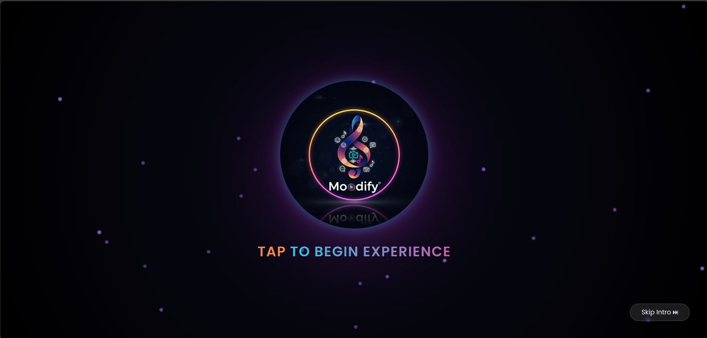
</div>

2. **Home**

<div style="margin-bottom:18px">
  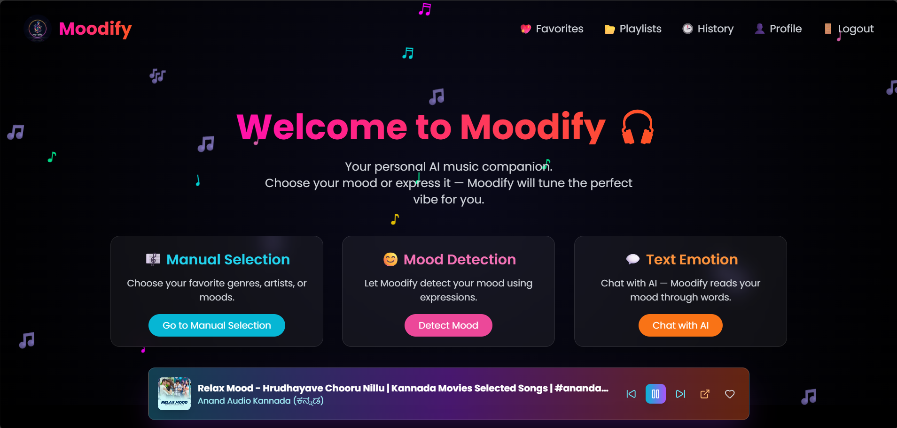
</div>

3. **Manual Selection**

<div style="margin-bottom:18px">
  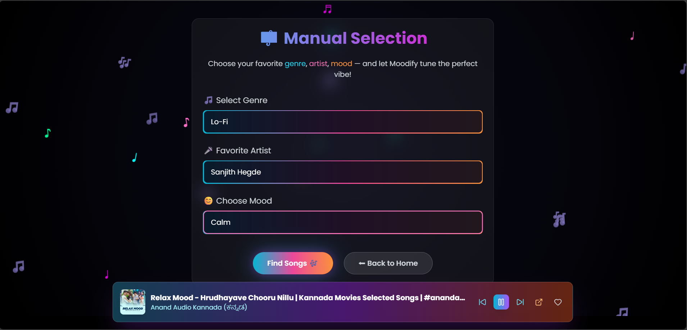
</div>

4. **Mood Detection**

<div style="margin-bottom:18px">
  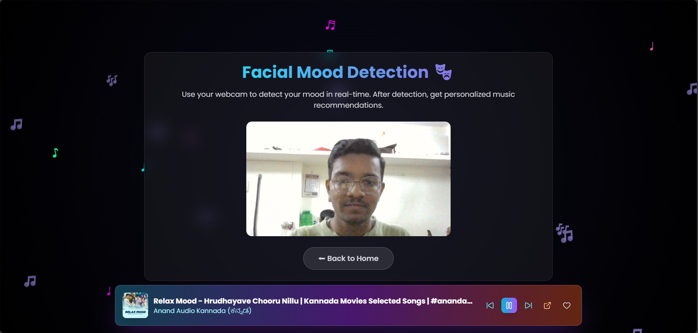
</div>

5. **Chat Mood Detection**

<div style="margin-bottom:18px">
  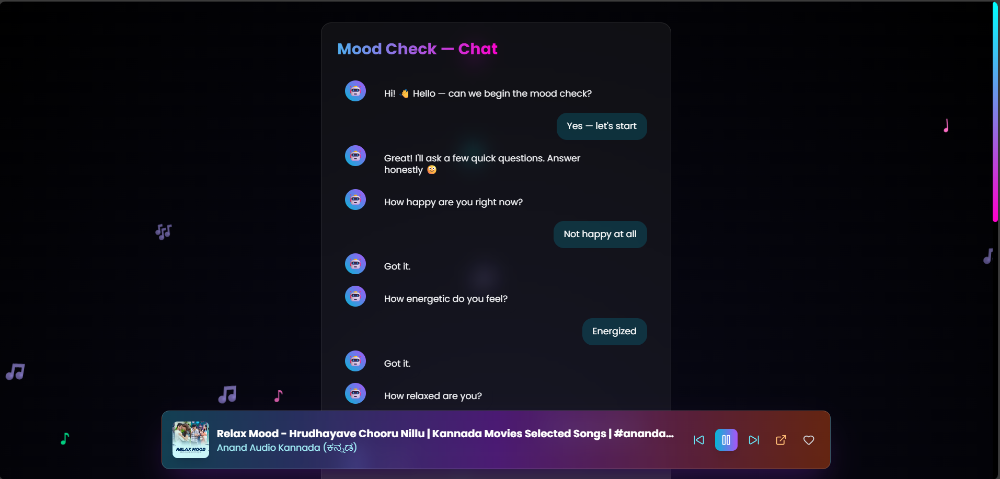
</div>

6. **Recommendations**

<div style="margin-bottom:18px">
  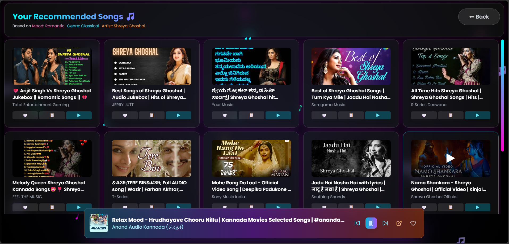
</div>

7. **Stream pages**

### Stream page layout

<div style="margin-bottom:12px">
  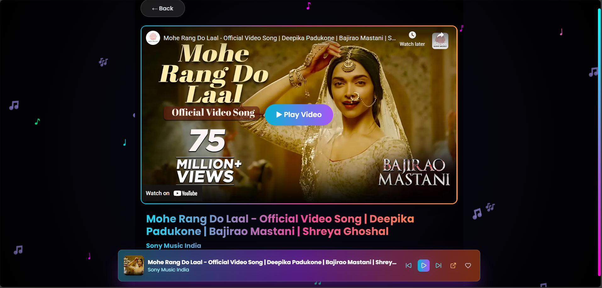
  <p style="color:#cbd5e1;margin-top:6px;font-size:14px">Layout showing container, video title and controls.</p>
</div>

### During video playing

<div style="margin-bottom:18px">
  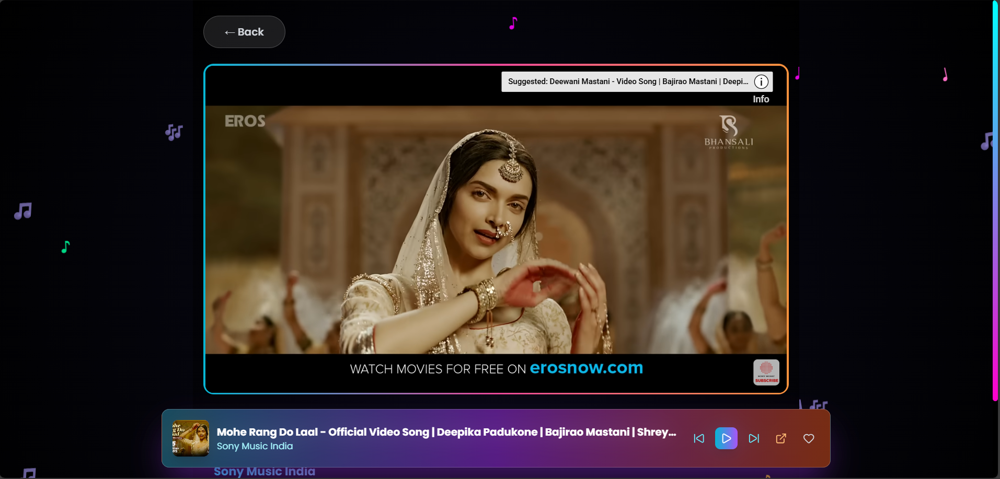
  <p style="color:#cbd5e1;margin-top:6px;font-size:14px">Stream page while video is playing.</p>
</div>

8. **Favorites**

<div style="margin-bottom:18px">
  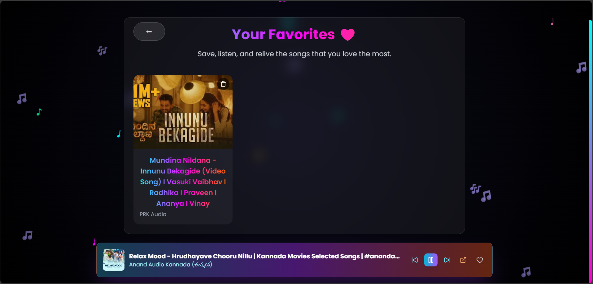
</div>

9. **Playlists**

<div style="margin-bottom:18px">
  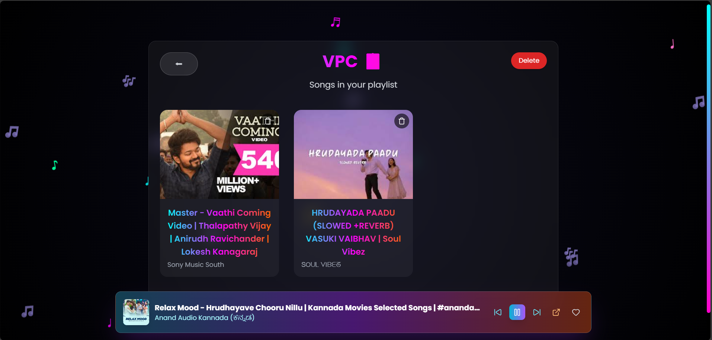
</div>

10. **History**

<div style="margin-bottom:18px">
  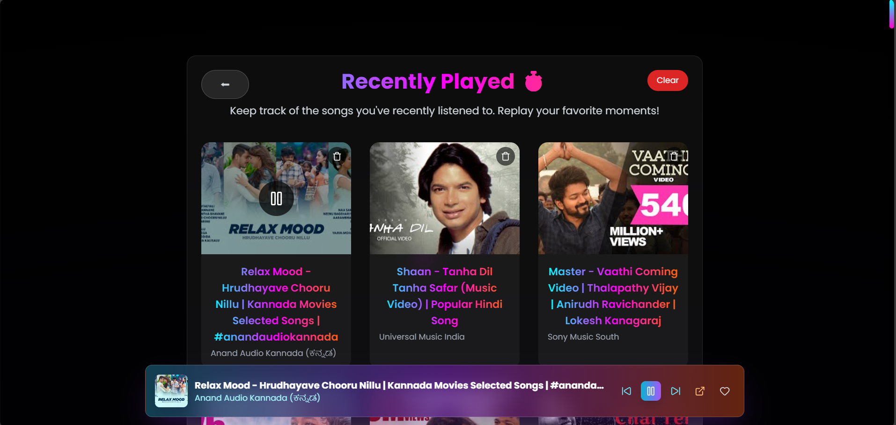
</div>

11. **Profile pages**

### Profile page

<div style="margin-bottom:12px">
  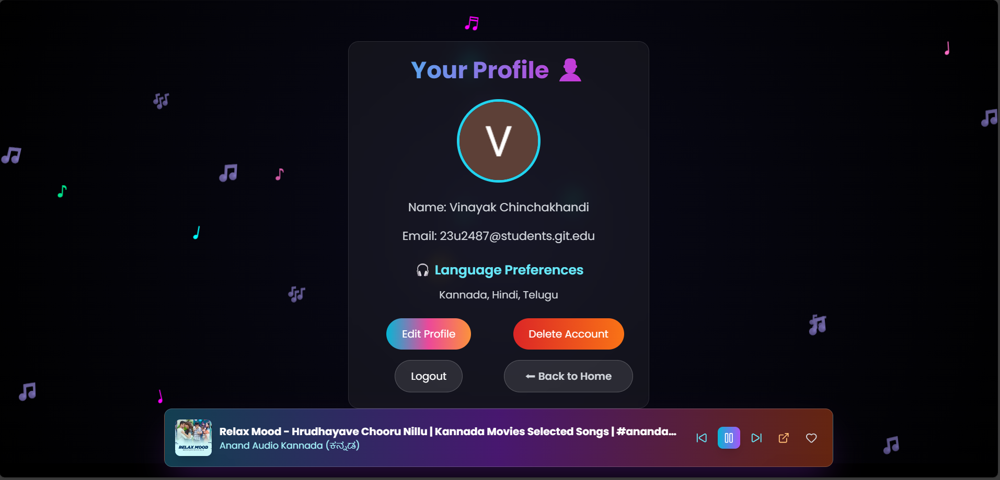
  <p style="color:#cbd5e1;margin-top:6px;font-size:14px">User profile with picture and preferences.</p>
</div>

### Edit profile page

<div style="margin-bottom:18px">
  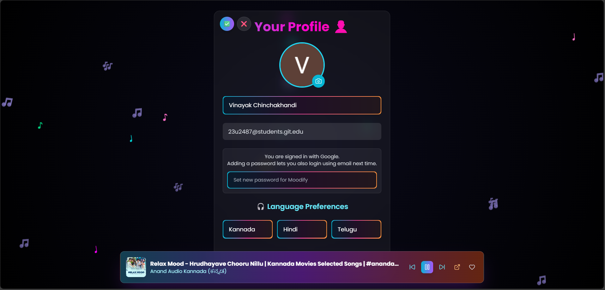
  <p style="color:#cbd5e1;margin-top:6px;font-size:14px">Edit profile screen for updating avatar and settings.</p>
</div>
